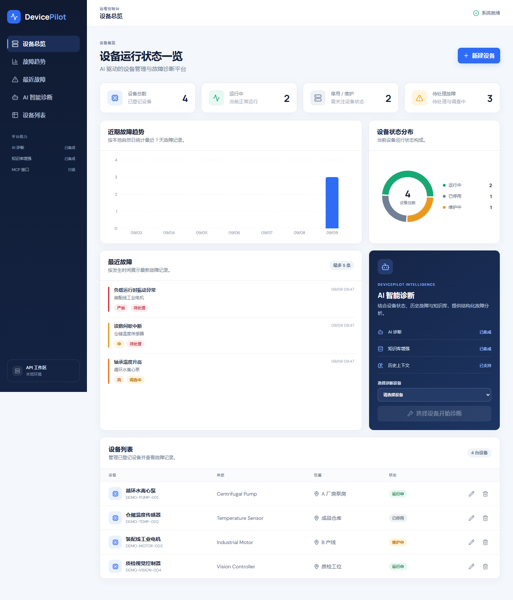
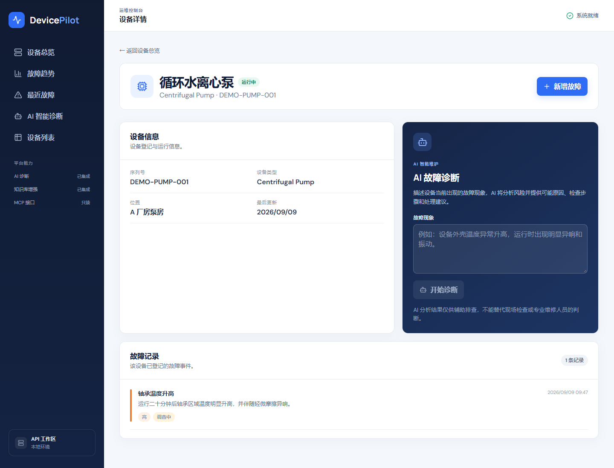
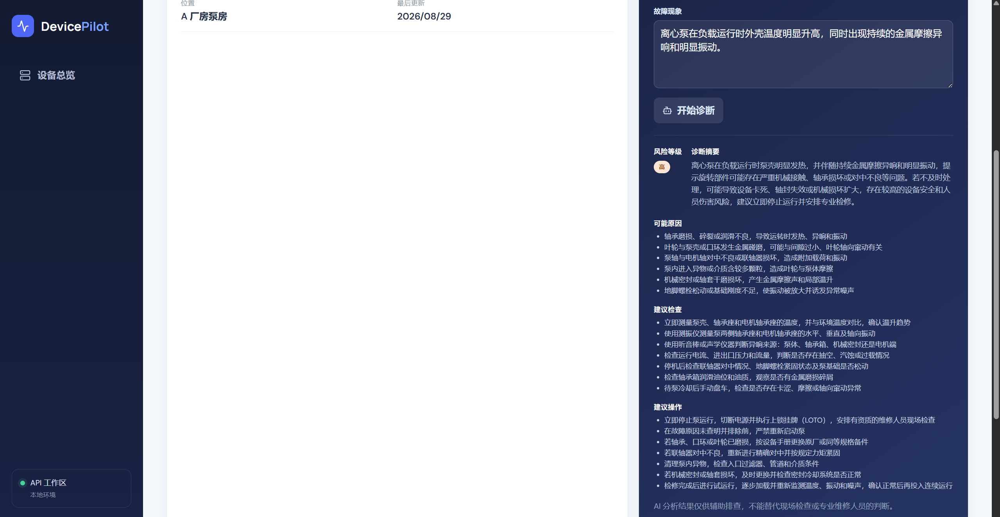

# DevicePilot

**AI 驱动的设备管理与故障诊断平台**

DevicePilot 是一个面向设备运维场景的 Portfolio MVP：统一管理设备与故障记录，并结合可信设备档案、现场故障现象、可选历史记录和本地 RAG 知识检索，生成结构化 AI 诊断建议。

> 当前状态：本地 MVP 与本地 production certification 已完成；尚未部署到公网 VPS，也没有自动 CD。

## 产品截图

### 设备总览



### 设备详情与故障记录



### AI 诊断结果



## 核心能力

- **设备管理**：创建设备、编辑状态、删除设备并查看详情
- **故障记录**：登记故障、开始调查、标记已解决与重新打开；保留完整历史，错误记录可确认后删除
- **运维 Dashboard**：展示设备运行状态和故障统计
- **结构化 AI 诊断**：输出风险等级、摘要、可能原因、建议检查和建议操作
- **可选本地 RAG**：使用 multilingual E5 与 persistent cosine Chroma 检索原创示例知识
- **有界诊断 Agent**：按确定性规则加载最多 5 条最近故障，并保持单次 Provider 调用
- **中文界面**：React 响应式 UI、清晰的加载/错误/空状态
- **自动化验证**：Pytest、Vitest、类型检查、构建、RAG 评估和 MCP verifier
- **生产部署定义**：Caddy、nginx/React、FastAPI 和 SQLite 的单机 Docker Compose 拓扑

## 架构

```text
React UI
   │ same-origin /api
   ▼
nginx
   ▼
FastAPI ── SQLAlchemy ── SQLite
   │
   ├── bounded LangGraph context flow
   ├── optional local E5 + Chroma retrieval
   └── LiteLLM ── configured external or local provider
```

生产拓扑使用 Caddy 作为唯一入口。Caddy 只发布 `80/443` 并执行全站 Basic Auth；frontend 和 backend 不发布宿主机端口。应用网络保持 `internal`，backend 通过独立的非 internal egress 网络访问配置的 HTTPS LLM Provider。

详细边界见 [Architecture](docs/ARCHITECTURE.md)。

## 技术栈

| 层 | 技术 |
| --- | --- |
| Backend | Python 3.12、FastAPI、Pydantic、SQLAlchemy、SQLite |
| AI | LiteLLM、LangGraph、sentence-transformers、Chroma |
| Frontend | React、TypeScript、Vite、lucide-react |
| Testing | Pytest、Vitest、Testing Library |
| Production | Docker Compose、Caddy、nginx |

## 项目结构

```text
app/                         FastAPI、业务服务、RAG、Agent、MCP
frontend/                    React 前端
knowledge/                   原创 Demo 知识文档
scripts/                     seed、索引、评估、MCP/代理边界验证、备份
skills/devicepilot-troubleshooting/
                             外部 Host 可加载的故障排查 Skill
compose.production.yml       独立单机生产拓扑
deploy/                      Caddy、nginx 与生产环境示例
.github/workflows/ci.yml      验证型 CI
```

## 本地运行

### Backend

```powershell
python -m venv .venv
.\.venv\Scripts\Activate.ps1
python -m pip install -r requirements-dev.txt
Copy-Item .env.example .env
python -m uvicorn app.main:app --reload
```

默认 API 地址为 `http://127.0.0.1:8000`，开发环境可访问 `/docs`。需要演示数据时显式执行：

```powershell
python -m scripts.seed_demo
```

### Frontend

```powershell
cd frontend
pnpm install --frozen-lockfile
pnpm dev
```

Vite 开发服务器通过同源 `/api` 代理访问 Backend。

### 本地 Docker Demo

```powershell
docker compose up --build
```

本地 Docker Compose 用于开发演示；独立生产拓扑及操作步骤见 [Production deployment and data recovery](docs/PRODUCTION_DEPLOYMENT.md)。

## AI 诊断约束

`LLM_MODEL` 选择单一 LiteLLM provider/model，密钥只保留在 Backend。DeepSeek 使用 `json_object`；明确支持 native schema 的 OpenAI 兼容模型使用严格 `json_schema`；其他模型使用 prompt JSON fallback。所有路径最终统一执行 `json.loads()` 和 `DiagnosisResult.model_validate()`。

每次诊断调用显式设置 `max_retries=0`，应用不实现自定义 retry。失败由安全的 HTTP 错误语义返回，前端不会把已过期请求的响应显示在修改后的症状下。

常用配置见 [.env.example](.env.example)。至少配置：

```dotenv
LLM_MODEL=deepseek/deepseek-v4-flash
LLM_API_KEY=
LLM_API_BASE=https://api.deepseek.com
LLM_TIMEOUT_SECONDS=20
RAG_ENABLED=false
```

## RAG 知识库

RAG 默认关闭。索引只接受 UTF-8 Markdown/TXT；embedding 与 Chroma 均在本地运行。满足设备类型过滤且 cosine distance 不高于 `0.143` 的 Top-K 文本会进入诊断上下文。若配置外部 LLM Provider，这些选中的文本也会发送到该 Provider。

```powershell
python -m scripts.index_knowledge --rebuild
python -m scripts.evaluate_rag
python -m scripts.evaluate_rag --real
```

生产环境必须在 backend container 内执行索引或重建，使命令使用 `/app/knowledge` 与 `/data/chroma`：

```sh
docker compose -f compose.production.yml exec -T backend \
  python -m scripts.index_knowledge --rebuild
```

## MCP 与 Troubleshooting Skill

MCP 已实现为 **本地只读 stdio server**，只提供 `get_device`、`get_recent_faults` 和 `search_knowledge`。它没有 remote HTTP transport、远程认证、写工具，也不在 production Compose 中运行。

```powershell
python -m scripts.verify_mcp
```

[DevicePilot Troubleshooting Skill](skills/devicepilot-troubleshooting/SKILL.md) 已作为仓库内的外部 Agent 操作指引实现，并有 14 场景行为矩阵。Host 侧安装/发现和托管 Skill 服务尚未实现。MCP、Skill 与 Backend 内部 LangGraph 是三个独立边界。

## API 概览

| Method | Path | 用途 |
| --- | --- | --- |
| `GET` | `/devices` | 设备列表 |
| `POST` | `/devices` | 创建设备 |
| `GET` | `/devices/{id}` | 设备详情 |
| `PUT` | `/devices/{id}` | 更新设备 |
| `DELETE` | `/devices/{id}` | 删除设备 |
| `GET` | `/devices/{id}/faults` | 故障列表 |
| `POST` | `/devices/{id}/faults` | 创建故障 |
| `GET` | `/faults/{id}` | 故障详情 |
| `PATCH` | `/faults/{id}` | 仅更新故障状态 |
| `DELETE` | `/faults/{id}` | 删除错误或测试记录 |
| `POST` | `/devices/{id}/diagnose` | 结构化诊断 |

## 验证

```powershell
python -m pytest -q
python -m compileall -q app scripts tests
python -m pip check
cd frontend
pnpm test
pnpm typecheck
pnpm build
```

CI 已实现，并在 pull request 与 `main` push 上执行 Backend、Frontend、Compose/Caddy、镜像构建和代理边界验证。CI 没有部署、镜像推送、SSH、VPS 凭据或生产 secrets 权限。**CD 尚未实现。**

## 生产状态与安全边界

- 本地 production Compose certification 已完成；公网 VPS deployment 尚未完成。
- Caddy 是唯一发布端口的服务，并提供 deployment-boundary Basic Auth。
- Basic Auth 适合当前单操作员部署边界；application-level multi-user authentication/authorization 尚未实现。
- Backend/Frontend 不发布宿主机端口；SQLite 与 Chroma 不对外暴露。
- 生产 secrets 来自 root-owned `/etc/devicepilot/backend.env` 与 `/etc/devicepilot/caddy.env`，仓库只保留 placeholder 示例。
- CI 是 validation-only；CD、自动部署和公网 Live Demo 均未实现。
- Remote MCP、托管 Skill runtime、PostgreSQL、分布式限流与多实例部署均未实现。

生产准备、备份、恢复、回滚和健康检查步骤见 [Production deployment and data recovery](docs/PRODUCTION_DEPLOYMENT.md)。当前实现状态见 [Current State](docs/CURRENT_STATE.md)，人工演示流程见 [Manual verification](docs/MANUAL_VERIFICATION.md)。

## License

本项目用于作品集展示与学习。部署者需自行评估真实设备、知识数据和 LLM Provider 的安全与合规要求。
